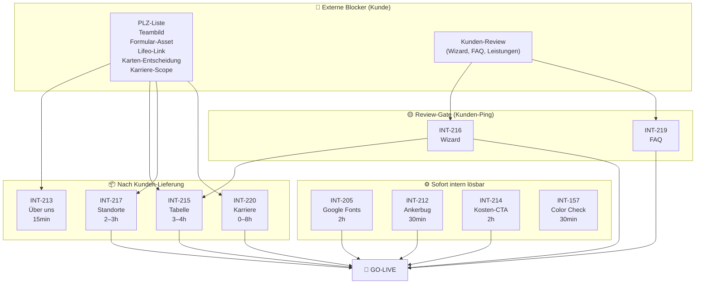
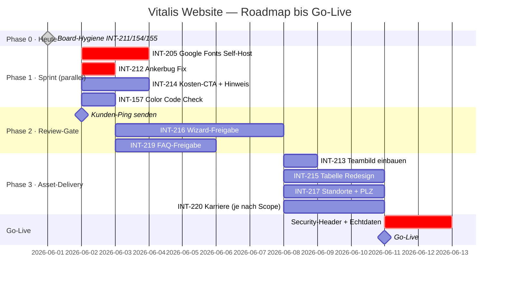

# 📊 Master Plan Report — Vitalis Seniorendienst Website
**Vollständige Issue-Analyse · Lösungskonzepte · Fragenkatalog**  
Stand: 2026-06-01 | Erstellt aus den Findings von: project-manager, data-analyst, frontend-webdesigner, code-reviewer, security-auditor

---

## 📋 Executive Summary

Das Projekt umfasst **13 offene Linear-Issues**, von denen mindestens 3 faktisch erledigt sind und das Board verzerren. Der einzige Go-Live-Blocker, der **heute ohne Kundenrücklauf** lösbar ist, ist ein DSGVO-Verstoß: Google Fonts lädt auf allen 10 Seiten vor dem Cookie-Consent-Banner — Lösung per Self-Hosting dauert 2 Stunden bei null Architekturrisiko. **44 % der verbleibenden Issues** sind ausschließlich durch fehlende Kunden-Assets blockiert (PLZ-Liste, Teambild, Formulare, Lifeo-Link) — kein Code-Problem, sondern ein Kommunikations-Flaschenhals. Ein einziger strukturierter Kunden-Termin mit 5 konkreten Lieferungen würde den Großteil des Boards entsperren.

**Top 3 Erkenntnisse:**
1. 🔴 **DSGVO-Pflicht verletzt** — Google Fonts + sorglos-pflege.de Widget übertragen IP-Adressen ohne Consent. Sofort behebbar, vor Go-Live zwingend.
2. 🗂️ **Board-Verzerrung** — INT-211, INT-154, INT-155 sind faktisch erledigt, stehen aber noch offen. Board-Cleanup schafft in 15 Minuten Klarheit über den echten Reststand.
3. 🔑 **Kunden-Kommunikation ist der Flaschenhals** — 6 von 10 verbleibenden echten Issues warten auf eine Kunden-Entscheidung oder -Lieferung, nicht auf Entwicklung.

---

## 🗂️ Board-Übersicht (alle 13 Issues, live aus Linear)

| ID | Titel | Status | Prio | Blocker | Aufwand |
|---|---|---|---|---|---|
| **INT-205** | Google Fonts entfernen | To Do | P0 | ⚙️ Keiner | ~2h |
| **INT-211** | Startseite | In Progress | P0 | ✅ Faktisch erledigt | 0 |
| **INT-212** | Leistungen | Review | P0 | ⚠️ Bug (tote Anker) | 30 min |
| **INT-213** | Über uns | In Progress | P0 | 🔴 Teambild fehlt | 15 min nach Lieferung |
| **INT-214** | Kostenübernahme CTA | In Progress | P0 | ⚙️ Keiner | ~2h |
| **INT-215** | Kosten-Tabelle Redesign | To Do | P1 | 🔴 Formular + Lifeo-Link | ~3–4h nach Lieferung |
| **INT-216** | Leistungs-Finder Wizard | Review | P1 | 🟡 Kunden-Freigabe | ~30 min Korrekturen |
| **INT-217** | Standorte | To Do | P0 | 🔴 PLZ-Liste + Karte | ~2–3h nach Lieferung |
| **INT-219** | FAQ | Review | — | 🟡 Kunden-Freigabe | 0 (technisch fertig) |
| **INT-220** | Karriere | To Do | P0 | 🔴 Kein Scope | 0–8h je nach Entscheidung |
| **INT-154** | Tabelle/Badges (alt) | Review | — | 🔄 Durch INT-215 superseded | Prüfen + schließen |
| **INT-155** | Pflegegrade erläutern | Review | — | 🔄 Durch INT-216 abgedeckt | Prüfen + schließen |
| **INT-157** | Color Code prüfen | Review | — | ⚙️ Schnell-Check | ~30 min |

**Echte Restlast** (nach Board-Cleanup): **10 Issues** — davon 2 sofort umsetzbar, 3 im Review-Gate, 5 extern blockiert.

---

## 🗺️ Roadmap & Abhängigkeits-Graph

### Blocker-Übersicht



### Zeitplan



---

## 📑 Issue-Steckbriefe

---

### INT-205 — Google Fonts Self-Hosting
**Status:** To Do · **Prio:** P0 · **Blocker:** Keiner · **Aufwand:** ~2h

| Kriterium | Bewertung |
|---|---|
| Priorität | 🔴 Kritisch — DSGVO-Pflicht, vor Go-Live zwingend |
| Aufwand | Gering (~2h einmalig) |
| Architektur-Risiko | ✅ Null — CSS-Variablen `--font-body`/`--font-heading` isolieren den Fix komplett von den 7.154 CSS-LOC |
| Ext. Abhängigkeit | Keine |

**Kernproblem:** Alle 10 HTML-Seiten binden Inter + Playfair Display via `fonts.googleapis.com` im `<head>` ein — synchron, **vor** dem Cookie-Banner (der erst nach 1.500 ms erscheint). Jeder Seitenaufruf überträgt die IP-Adresse des Besuchers an Google ohne Einwilligung. Das LG München I (Az. 3 O 17493/20) verurteilte exakt dieses Muster.

**Lösung (empfohlen — Variante A Self-Hosting):**
1. WOFF2-Dateien via [google-webfonts-helper.herokuapp.com](https://google-webfonts-helper.herokuapp.com) herunterladen (Inter 400/500/600/700, Playfair 600/700) → `assets/fonts/`
2. `@font-face`-Blöcke mit `font-display: swap` direkt unter den `:root`-Block in `main.css` einfügen
3. In allen 10 HTML-Dateien: CDN-Links + `preconnect`/`dns-prefetch` zu Google entfernen, stattdessen `<link rel="preload">` für die 2 LCP-kritischen Gewichte (Inter 400 + 600)

**Alternativen:**

| Variante | Pro | Contra | Empfehlung |
|---|---|---|---|
| A — Self-Host WOFF2 | Kein externer Request, volle Kontrolle, schneller Load | Manuelles Update bei Font-Releases | ✅ Empfohlen |
| B — Variable Fonts | Weniger Dateien | Inter Variable > 290 KB vs. 4 × ~25 KB statisch | Nur bei explizitem Wunsch |
| C — System-Font-Stack | Null Font-Load | Brand-Identity (Playfair-Headings) geht verloren | ❌ |

> **WCAG-Hinweis:** `font-display: swap` zeigt 100 ms System-Font bevor der eigene Font erscheint — das ist für Senioren besser als `font-display: block` (bis zu 3 s unsichtbarer Text).

---

### INT-211 — Startseite
**Status:** In Progress · **Prio:** P0 · **Empfehlung: Sofort auf Done setzen**

Alle Checkboxen im Issue sind gesetzt. Der In-Progress-Status verzerrt das Board. Keine offene Entwicklungsarbeit vorhanden.

---

### INT-212 — Leistungen
**Status:** Review · **Prio:** P0 · **Blocker:** ⚠️ Bug (tote Anker)

| Kriterium | Bewertung |
|---|---|
| Inhaltliche Vollständigkeit | ✅ 6 Leistungskarten, 3 Detail-Sektionen, 4-Schritt-Prozess, CTA |
| Kritischer Bug | Feature-Cards „Einkaufshilfe" + „Botengänge" verlinken auf `#einkaufshilfe-detail` und `#botengaenge-detail` — diese Anker existieren im HTML nicht. Tastaturnavigation und Screen-Reader landen im Nirgendwo. |
| WCAG-Risiko | 🔴 WCAG 2.4.1 (Bypass Blocks) und 1.3.1 — muss vor Review-Abnahme behoben sein |

**Fix — 2 Varianten:**

| Variante | Beschreibung | Aufwand | Empfehlung |
|---|---|---|---|
| A — Toggle-Expansion | Button mit `aria-expanded` + ausklappbarem Panel mit 3–4 Bullet-Points direkt in der Feature-Card (kein Bild nötig) | ~2h | ✅ Sofort umsetzbar |
| B — Vollständige Detail-Sektion | Analog zu den 3 bestehenden Detail-Sektionen (Bild + Bulletlist + CTA) | ~2–3h + 2 Bilder | Wenn Bilder geliefert werden |

**Empfehlung:** Variante A als Zwischen-Release. Upgrade auf Variante B sobald Kundenbilder vorliegen. Nach Bug-Fix: Issue auf Done setzen.

---

### INT-213 — Über uns
**Status:** In Progress · **Prio:** P0 · **Blocker:** 🔴 Teambild fehlt

Die Seite ist vollständig implementiert. Einziger offener Punkt: das Teambild. Technischer Aufwand nach Foto-Lieferung: 15 Minuten (img-Tag tauschen + alt-Text). Issue ist bis zur Foto-Lieferung vollständig extern blockiert. Kein Code-Aufwand im Vorfeld sinnvoll.

---

### INT-214 — Kostenübernahme: CTA + Pflegegrad-Hinweis
**Status:** In Progress · **Prio:** P0 · **Blocker:** Keiner · **Aufwand:** ~2h

**Offene Punkte:**
1. **CTA präsenter** — die bestehende Standard-`cta-section` am Seitenende nutzt nicht den Peak-Motivations-Moment direkt nach der Leistungstabelle
2. **„Ohne Pflegegrad"-Hinweis** — Information existiert nur im Wizard-Flow, fehlt für Nutzer die den Wizard nicht starten

**Lösung CTA (Variante B — Mid-Page CTA, empfohlen):**
Direkt nach der Leistungstabelle eine kontextualisierte CTA-Sektion mit:
- Headline „Bis zu 131 € monatlich stehen Ihnen zu"
- 3 Trust-Chips (Kein Papierkram / Direkte Kassenabrechnung / Kostenlose Beratung)
- Zwei Buttons: „Jetzt kostenlos beraten lassen" + „Direkt anrufen"

**Lösung Pflegegrad-Hinweis (Variante A — 2-Spalten-Zielgruppen-Box, empfohlen):**
Unmittelbar vor dem Wizard eine Card-Box mit zwei Spalten:
- Links: „Sie haben einen Pflegegrad?" → zum Wizard
- Rechts: „Noch kein Pflegegrad?" → zu Kontakt + Hinweis auf kostenlose Antragshilfe

> **WCAG-Korrektur:** In den Design-Mockups empfohlene Emojis (📋💬) durch SVG-Icons ersetzen — Emojis haben inkonsistente Screen-Reader-Ausgabe und wirken im Pflegekontext unseriös.

---

### INT-215 — Kostenübernahme: Leistungstabelle Redesign
**Status:** To Do · **Prio:** P1 · **Blocker:** 🔴 Formular-Asset + Lifeo-Link (+ INT-216 Freigabe)

**Externes Blocker-Set:**
- Formular-Dokument „ALLE Leistungen" (PDF/URL) — vom Kunden noch nicht geliefert
- Partner-Link „Lifeo Hausnotruf" — URL ausstehend
- §45a-Umwidmungsdaten — aus INT-216-Wizard übernehmen (erst nach dessen Freigabe)

**Kritisches Design-Problem:** Die bestehende 6-spaltige Tabelle (Leistung · PG1–PG5) ist auf Mobile (375px) für die Senioren-Zielgruppe unlesbar. `data-attr + ::before content`-Reflow scheitert bei `colspan`-Zellen.

**Lösung (Variante B — Responsive Card-Stack):**
- **Desktop:** bestehende Tabelle beibehalten
- **Mobile:** via `display: none` toggle (CSS-only, kein JS) eine `<dl>`-basierte Card-Ansicht pro Leistungsart zeigen
- Gemeinsame JS-Konstante `PFLEGEKASSE_BETRAEGE` für Wizard + Tabelle einführen — verhindert Inkonsistenz bei Betragsänderungen

**Verlinkungen:** Bis Kunden-Assets vorliegen, Platzhalter-Text „Weitere Informationen auf Anfrage" mit Kontakt-Link. Kein leeres Feld zeigen.

---

### INT-216 — Leistungs-Finder Wizard
**Status:** Review · **Prio:** P1 · **Blocker:** 🟡 Kunden-Freigabe

Technisch vollständig implementiert (3 Schritte, JS-Ergebnis-Screen, ARIA-Labels, Back-Navigation, Fortschrittsanzeige). Wartet auf Kunden-Review der Ergebnis-Texte und Beträge.

**Zwei WCAG-Verbesserungen (unabhängig vom Review umsetzbar):**

| Problem | Fix |
|---|---|
| Wizard-Option-Buttons ohne `min-height` Garantie auf Mobile | `min-height: 56px` für `.wizard__option-btn`, `min-height: 64px` für `.wizard__pg-btn` in `components.css` |
| Schrittwechsel wird von Screen-Readern nicht angesagt | `aria-live="assertive"` auf Fortschrittsanzeige setzen + Schritt-Text bei Wechsel aktualisieren |

**Empfehlung Ergebnis-Screen:** Entlastungsbetrag (Vitalis-relevant) als „Hero-Betrag" visuell hervorheben, übrige Leistungen kleiner darunter — Fokus auf den für den Nutzer direkt relevanten Wert.

---

### INT-217 — Standorte
**Status:** To Do · **Prio:** P0 · **Blocker:** 🔴 PLZ-Liste + Karten-Technologie-Entscheidung

**PLZ-Checker:** Logik ist implementiert, `VITALIS_PLZ`-Array ist leer. Aufwand nach Lieferung: Befüllen des Arrays (~15 min) + Regions-Texte um konkrete Ortsnamen ergänzen (SEO-Effekt).

**Karten-Technologie:** Issue-Kommentar „neue Karte verwenden" ist unklar. Optionen:

| Variante | Pro | Contra | Empfehlung |
|---|---|---|---|
| A — Leaflet/OSM + Privacy-Gate | Kostenlos, bereits implementiert, DSGVO-konform nach Fix | OSM-Tiles gelegentlich langsam | ✅ Empfohlen |
| B — Google Maps Embed | Vertraut für Senioren | DSGVO-Gate nötig, potenzielle Kosten | Nur auf expliziten Kundenwunsch |
| C — Statisches SVG/PNG | Kein Consent nötig, null externe Abhängigkeit | Nicht zoombar, manueller Update-Aufwand | Als Datenschutz-Fallback |

**Privacy-Gate Umsetzung (WCAG-korrigiert):**  
Kein leeres Vakuum zeigen — stattdessen ein **statisches Vorschaubild** (PNG/JPG der Karte) mit Datenschutzhinweis-Link und „Interaktive Karte aktivieren"-Button. So sehen Senioren sofort den Inhalt, ohne dass OSM lädt. Erst nach Klick wird Leaflet initialisiert.

> **Gegencheck:** Click-Gate ohne Vorschaubild würde Senioren verwirren (leeres Feld, kein Kontext). Das statische-Bild-Pattern ist WCAG-2.4.5-konform und barrierefrei.

---

### INT-219 — FAQ
**Status:** Review · **Blocker:** 🟡 Kunden-Text-Freigabe

Die `faq.html` ist technisch vollständig (10 Fragen, Accordion-Funktionalität, korrekte ARIA-Attribute). Kein Entwicklungsaufwand ausstehend. Wartet ausschließlich auf Kunden-Freigabe der Inhalte. → Nach Freigabe sofort auf Done setzen.

---

### INT-220 — Karriere
**Status:** To Do · **Prio:** P0 · **Blocker:** 🔴 Kein Scope definiert

Die `karriere.html` ist bereits vollständig implementiert: 6 Benefit-Kacheln, 2 Stellenangebote (Alltagsbegleiter + Haushaltshilfe), Bewerbungs-CTA. Der Kunde hat die Seite noch nicht bewertet.

**Optionen je nach Kunden-Entscheidung:**

| Variante | Scope | Aufwand | Empfehlung |
|---|---|---|---|
| A — Status quo | Seite wie sie ist freigeben | 0h | ✅ Wenn Kunde zufrieden |
| B — Minimal-Erweiterung | Mitarbeiter-Testimonial + FAQ-Toggle + Initiativbewerbung prominent | ~3–4h + Kunden-Content | ✅ Bei Verbesserungswunsch |
| C — Vollausbau | Bewerbungsformular + Galerie + Gehaltsspanne + Bewerbungsprozess-Timeline | ~8–10h + Fotos | Nur bei aktivem Recruiting-Ziel |

---

### INT-154 — Kostenübernahme-Tabelle (alt) + INT-155 — Pflegegrade erläutern
**Status beider:** Review · **Empfehlung: Prüfen + schließen**

- **INT-154** ist inhaltlich durch INT-215 (Tabellen-Redesign) vollständig superseded.
- **INT-155** ist durch die implementierte Pflegegrade-Tab-Sektion in `kostenuebernahme.html` + den Wizard-Flow (INT-216) abgedeckt.
Beide Issues kurz gegenchecken, dann schließen. Dadurch sinkt die sichtbare Board-Last sofort.

---

### INT-157 — Color Code prüfen
**Status:** Review · **Aufwand:** ~30 min

Kurzer Spot-Check: CSS-Variablen in `main.css `:root`` gegen die Brand-Palette (Primary Blue `#2f5dff`, Deep Blue `#0f2ccf`, Sage Green `#4b916d`, Off-White `#f1f0ef`, Near Black `#151414`) auf Konsistenz und WCAG-AA-Kontrast prüfen. Wenn korrekt: Done. Wenn Abweichungen: sofortiger Fix in `:root`.

---

## 🔒 DSGVO-Compliance: Übersicht externe Dienste

| Dienst | Seite | Consent-Gate | Datenschutz-Erklärung | Status |
|---|---|---|---|---|
| Google Fonts CDN | Alle 10 | ❌ Fehlt | ✅ Genannt | 🔴 Verstoß — INT-205 |
| sorglos-pflege.de Widget | index.html | ❌ Fehlt | ❌ Fehlt | 🔴 Verstoß — sofort nachtragen |
| Formspree | kontakt.html | N/A (Opt-in) | 🟡 „ggf." | 🟠 AVV + echte ID ausstehend |
| OpenStreetMap via Leaflet | standorte.html | ❌ Fehlt | ✅ Genannt | 🟠 Privacy-Gate fehlt |
| unpkg.com CDN (Leaflet) | standorte.html | N/A | ❌ Nicht erwähnt | 🟡 SRI-Hash fehlt |

**Vor Go-Live zwingend:**
1. Google Fonts self-hosten (INT-205) → beseitigt größtes Risiko komplett
2. sorglos-pflege.de in Datenschutzerklärung nachtragen + Widget per Consent laden
3. Formspree-ID einsetzen + DPA im Formspree-Dashboard aktivieren
4. Leaflet/OSM Privacy-Gate (statisches Vorschaubild-Pattern)

---

## ✅ Empfehlungen (priorisiert)

### Priorität 1 — Heute, kein Warten (Phase 0 + Phase 1)
1. **INT-211 auf Done setzen** — 0 Aufwand, sofortige Board-Klarheit
2. **INT-154 + INT-155 prüfen + schließen** — wahrscheinlich superseded, 15 min
3. **INT-205 Google Fonts self-hosten** — DSGVO-Pflicht, 2h, null Risiko, sofort startbar
4. **INT-212 Ankerbug fixen** — 30 min, Barrierefreiheits-Pflicht vor Review-Abnahme
5. **INT-214 CTA + Pflegegrad-Hinweis** — 2h, kein externer Blocker, Conversion-Gewinn

### Priorität 2 — Diese Woche (Phase 2, Kunden-Ping nötig)
6. **Kunden-Ping senden** mit Freigabe-Anfrage für INT-216 (Wizard) + INT-219 (FAQ) — idealerweise als ein strukturiertes E-Mail mit Fragenkatalog unten
7. **INT-157 Color Code verifizieren** — 30 min Spot-Check, dann Done oder Fix

### Priorität 3 — Nach Kunden-Lieferung (Phase 3, parallel möglich)
8. **INT-217 Standorte** — sobald PLZ-Liste vorliegt: Array befüllen + Privacy-Gate + Regions-Texte
9. **INT-215 Tabelle** — sobald Formular-Asset + Lifeo-Link + INT-216-Freigabe vorliegen: Responsive Card-Stack
10. **INT-213 Über uns** — sobald Teambild vorliegt: 15 min Aufwand
11. **INT-220 Karriere** — sobald Scope definiert: 0–8h je nach Entscheidung

### Priorität 4 — Deployment (Go-Live-Checkliste)
12. Security-Header setzen (CSP, X-Frame-Options, HSTS, Referrer-Policy) beim Hosting-Provider
13. Formspree-Platzhalter durch echte ID ersetzen + Honeypot aktivieren
14. Echtdaten eintragen (Telefon, Adresse, Impressum, Formspree-ID)
15. Cache-Header für selbst-gehostete Fonts: `Cache-Control: public, max-age=31536000, immutable`

---

## ➡️ Nächste Schritte

| Wer | Was | Wann |
|---|---|---|
| Entwicklung | INT-211 auf Done setzen | Heute sofort |
| Entwicklung | INT-154, INT-155 gegenchecken + ggf. schließen | Heute |
| Entwicklung | INT-205 Google Fonts Self-Host starten | Morgen früh |
| Entwicklung | INT-212 Ankerbug + INT-157 Color Check | Parallel zu INT-205 |
| Entwicklung | INT-214 Mid-Page CTA + Zielgruppen-Box | Diese Woche |
| Projektleitung | Fragenkatalog (unten) an Kunden senden | Heute noch |
| Kunde | PLZ-Liste, Teambild, Formular-Asset, Lifeo-Link, Wizard-Freigabe | So früh wie möglich |
| Entwicklung | INT-215, INT-217, INT-213, INT-220 | Nach Kunden-Lieferung |
| Hosting/DevOps | Security-Header + Echtdaten + Formspree-ID | Vor Go-Live |

**Wichtigster Hebel:** Ein einziger Kunden-Termin mit 5 Lieferungen (PLZ-Liste · Teambild · Formular-Asset · Lifeo-Link · Wizard-Freigabe) würde 5 von 7 noch blockierten Issues entsperren und den Weg zum Go-Live freimachen.

---

## ❓ Fragenkatalog an den Kunden (kopierfertig)

```
Betreff: Vitalis Website — Klärungsbedarf vor Go-Live (bitte um kurze Rückmeldung)

Sehr geehrte Damen und Herren,

für die Fertigstellung und den Launch der Website benötigen wir Ihre Entscheidung 
oder Zulieferung zu folgenden Punkten. Wir haben diese in Kategorien gegliedert, 
damit Sie strukturiert antworten können.

══════════════════════════════════════════════════════════
BLOCK A — DSGVO & EXTERNE DIENSTE (vor Go-Live zwingend)
══════════════════════════════════════════════════════════

F1 — Google Schriftarten (Datenschutz-Pflicht):
   Die Website lädt aktuell Schriften direkt von Google-Servern, was nach 
   aktuellem Recht ohne Einwilligung nicht zulässig ist. Wir empfehlen, 
   die Schriften lokal einzubinden (ca. 2 Stunden Aufwand, für Sie nicht 
   sichtbar — das Schriftbild bleibt identisch).
   → Geben Sie hierfür grünes Licht?

F2 — sorglos-pflege.de Bewertungs-Widget:
   Das Bewertungs-Widget auf der Startseite ist aktuell nicht in Ihrer 
   Datenschutzerklärung erwähnt, obwohl es Daten überträgt.
   a) Soll das Widget weiter eingebunden bleiben?
   b) Falls ja: Bitte senden Sie uns die Datenschutzerklärung von 
      sorglos-pflege.de (oder den Link dazu), damit wir Ihre Erklärung 
      entsprechend ergänzen können.

F3 — Kontaktformular (Formspree):
   Das Formular auf der Kontaktseite benötigt noch eine gültige 
   Formspree-ID, damit Nachrichten zugestellt werden.
   a) Haben Sie ein Formspree-Konto? Wenn ja: bitte die Formular-ID 
      übermitteln (Format: xxxxxxxx, 8 Zeichen).
   b) Haben Sie in Ihrem Formspree-Konto den Auftragsverarbeitungsvertrag 
      (DPA) aktiviert? (Settings → GDPR → Enable DPA). Dies ist für die 
      DSGVO-Konformität zwingend.
   c) Falls Sie kein Formspree-Konto anlegen möchten: Sollen wir eine 
      EU-basierte Alternative evaluieren?

F4 — Interaktive Karte (Standorte-Seite):
   Die Standorte-Karte lädt Daten von OpenStreetMap. Wir empfehlen ein 
   datenschutzfreundliches Vorgehen: Beim Seitenaufruf wird zunächst ein 
   statisches Kartenbild angezeigt; die interaktive Karte lädt erst nach 
   einem Klick auf „Karte aktivieren".
   a) Sind Sie mit diesem Ansatz einverstanden?
   b) Falls Sie stattdessen Google Maps bevorzugen: Haben Sie einen 
      Google Maps API-Key?

F5 — Hosting-Anbieter:
   Auf welchem Server / Hosting-Anbieter wird die Website laufen?
   (Wichtig für die Einrichtung von Sicherheits-Headern und HTTPS.)

══════════════════════════════════════════════════════════
BLOCK B — FEHLENDE INHALTE UND ASSETS
══════════════════════════════════════════════════════════

F6 — PLZ-Liste Einzugsgebiet (Standorte-Seite):
   Der „Ist mein Ort dabei?"-Checker benötigt eine vollständige Liste 
   Ihrer Postleitzahlen. Bitte senden Sie uns alle PLZ, in denen Sie 
   tätig sind (Excel, CSV, Textliste — jedes Format ist gut).

F7 — Teambild (Über-uns-Seite):
   Sobald ein Team- oder Portraitfoto vorliegt, können wir es in 
   unter 15 Minuten einbauen.
   → Bitte das Foto als JPG/PNG zusenden (mind. 800×600 px).

F8 — Bilder für Leistungsseite:
   Für drei Leistungsbereiche (Haushaltshilfe, Soziale Betreuung, 
   Arztfahrten) sind Fotos vorgesehen.
   a) Haben Sie eigene Bilder, die wir verwenden dürfen?
   b) Oder sollen wir lizenzfreie Stockfotos wählen?

F9 — Dokument „Alle Leistungen" (Kostenübernahme-Seite):
   In der Leistungstabelle ist ein Link auf ein Übersichtsdokument 
   „Alle Leistungen" geplant.
   a) Existiert dieses Dokument (PDF, Webseite oder ähnliches)?
   b) Falls ja: bitte Link oder Datei zusenden.

F10 — Partner Lifeo Hausnotruf (Kostenübernahme-Seite):
   Ein Link zum Lifeo-Hausnotruf-Partnerangebot soll in die 
   Leistungstabelle eingebaut werden.
   → Wie lautet die korrekte URL zu Ihrem Lifeo-Partnerangebot?

══════════════════════════════════════════════════════════
BLOCK C — FREIGABEN UND SCOPE-ENTSCHEIDUNGEN
══════════════════════════════════════════════════════════

F11 — Leistungs-Finder Wizard (Freigabe):
   Der interaktive 3-Schritt-Assistent auf der Kostenübernahme-Seite 
   ist fertig implementiert. Bitte prüfen Sie:
   a) Sind die angezeigten Beträge korrekt (131 €/Monat Entlastungsbetrag 
      für PG1–5, Pflegegeld nach PG2–5, Verhinderungspflege 3.539 €/Jahr)?
   b) Sind die Ergebnis-Texte inhaltlich korrekt und freigegeben?
   c) Fehlt ein Weg oder Ergebnis-Szenario?

F12 — Karriere-Seite (Scope-Entscheidung):
   Die Karriere-Seite ist bereits fertig mit 2 Stellenangeboten und 
   Bewerbungs-CTA. Noch ausstehend ist Ihr Feedback:
   a) Entspricht die Seite Ihren Vorstellungen?
   b) Sollen Mitarbeiter-Testimonials ergänzt werden? Falls ja: 
      Haben Sie Mitarbeiterinnen/Mitarbeiter, die ein kurzes Zitat 
      geben würden (mit Ihrem Einverständnis zu Foto + Name)?
   c) Möchten Sie eine Gehaltsangabe/Stundenlohn-Bandbreite sichtbar 
      machen?

F13 — Karten-Technologie (Standorte-Seite):
   Im Linear-Issue steht „neue Karte verwenden – Anfragen". 
   Meinen Sie damit:
   a) Eine andere Karten-Software (z. B. Google Maps statt der 
      aktuellen OpenStreetMap-Lösung)?
   b) Oder Optimierungen der bestehenden Karte (Farben, Zoom, Marker)?
   Bitte kurz beschreiben, was Sie sich vorstellen.

══════════════════════════════════════════════════════════
BLOCK D — ECHTDATEN (alle Seiten)
══════════════════════════════════════════════════════════

F14 — Telefonnummer:
   Alle Seiten zeigen noch „+49 89 XXX XXX XX" als Platzhalter.
   → Bitte teilen Sie uns Ihre offizielle Telefonnummer mit.

F15 — Adresse und Impressum-Pflichtangaben:
   Alle Seiten zeigen noch „Musterstraße 1, 85435 Erding" als Platzhalter. 
   Das Impressum benötigt zusätzlich:
   - Offizielle Geschäftsadresse
   - HRB-Nummer (Handelsregisternummer)
   - USt-ID oder Steuer-Nr.
   - Name des/der Geschäftsführer/in
   → Bitte alle Pflichtangaben für das Impressum zusenden.

══════════════════════════════════════════════════════════

Vielen Dank für Ihre Rückmeldung. Bei Fragen stehen wir gerne zur Verfügung.

Mit freundlichen Grüßen
[Ihr Name]
```

---

*Report erstellt: 2026-06-01 | Quellen: project-manager, data-analyst, frontend-webdesigner, code-reviewer, security-auditor*
