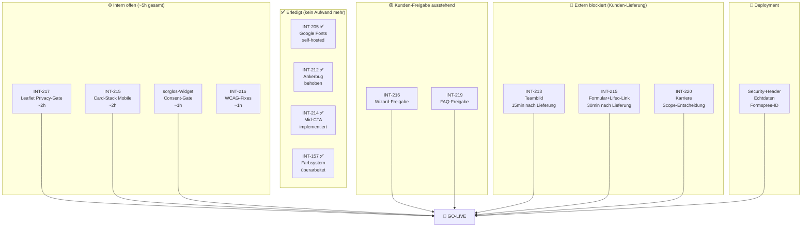
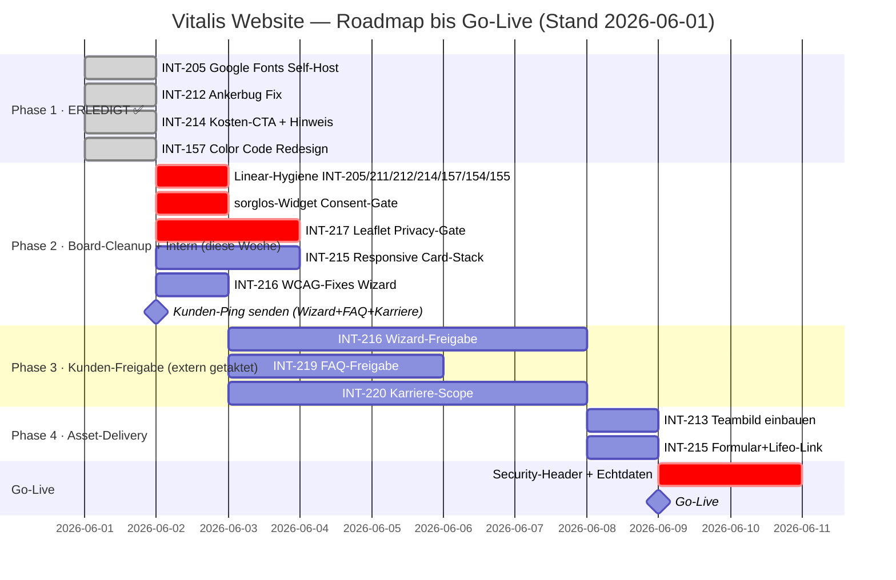

# 📊 Master Plan Report — Vitalis Seniorendienst Website
**Vollständige Issue-Analyse · Lösungskonzepte · Fragenkatalog**  
Stand: 2026-06-01 | Erstellt aus den Findings von: project-manager, data-analyst, frontend-webdesigner, code-reviewer, security-auditor  
**Zuletzt aktualisiert: 2026-06-01** — Code-Abgleich aller HTML/CSS/JS-Dateien gegen Planstand

---

## 📋 Executive Summary

~~Das Projekt umfasst **13 offene Linear-Issues**, von denen mindestens 3 faktisch erledigt sind und das Board verzerren. Der einzige Go-Live-Blocker, der **heute ohne Kundenrücklauf** lösbar ist, ist ein DSGVO-Verstoß: Google Fonts lädt auf allen 10 Seiten vor dem Cookie-Consent-Banner — Lösung per Self-Hosting dauert 2 Stunden bei null Architekturrisiko.~~

**Aktualisierter Stand (2026-06-01 Code-Abgleich):** Von den ursprünglich 13 Issues sind **6 vollständig im Code implementiert** (INT-205, INT-211, INT-212, INT-214, INT-157, INT-217-teilweise). Der größte bisherige DSGVO-Blocker (Google Fonts) ist beseitigt. **3 Issues** sind technisch fertig und warten nur auf Kunden-Freigabe. **2 verbleibende DSGVO-Risiken** (sorglos-pflege.de Widget + Leaflet/OSM) müssen vor Go-Live noch adressiert werden — sie sind intern lösbar.

**Top 3 aktuelle Erkenntnisse:**
1. ✅ **INT-205 erledigt** — Google Fonts sind vollständig self-hosted (WOFF2 in `assets/fonts/`, `@font-face` in `main.css`). Kein Google-CDN-Request mehr auf keiner der 10 Seiten.
2. 🔴 **2 DSGVO-Risiken verbleiben** — sorglos-pflege.de Widget lädt via JS ohne Consent-Gate (CSS-hidden reicht nicht); Leaflet/OSM auf standorte.html ohne Privacy-Gate. Beide intern behebbar.
3. 🔑 **Kunden-Kommunikation bleibt Flaschenhals** — INT-213 (Teambild), INT-216 (Wizard-Freigabe), INT-219 (FAQ-Freigabe) und INT-220 (Karriere-Scope) warten ausschließlich auf Kunden-Rückmeldung.

---

## 🗂️ Board-Übersicht (alle 13 Issues — mit aktuellem Implementierungsstand)

| ID | Titel | Linear-Status | Code-Status | Blocker | Restaufwand |
|---|---|---|---|---|---|
| **INT-205** | Google Fonts entfernen | To Do | ✅ **Implementiert** | — | Linear schließen |
| **INT-211** | Startseite | In Progress | ✅ **Fertig** | — | Linear schließen |
| **INT-212** | Leistungen | Review | ✅ **Ankerbug behoben** (Variante A) | — | Linear schließen / Review abnehmen |
| **INT-213** | Über uns | In Progress | 🟡 Seite fertig, Unsplash-Platzhalter | 🔴 Teambild fehlt (Kunde) | 15 min nach Foto-Lieferung |
| **INT-214** | Kostenübernahme CTA | In Progress | ✅ **Mid-CTA + Trust-Chips implementiert** | — | Linear schließen |
| **INT-215** | Kosten-Tabelle Redesign | To Do | 🟡 Tabelle vorhanden, horizontaler Scroll | 🔴 Formular + Lifeo-Link fehlen | Responsive Card-Stack ausstehend |
| **INT-216** | Leistungs-Finder Wizard | Review | ✅ **Technisch fertig** | 🟡 Kunden-Freigabe Texte + Beträge | ~30 min Korrekturen nach Feedback |
| **INT-217** | Standorte | To Do | ✅ **PLZ-Array befüllt** (Erding/Ebersberg/Freising/Moosburg/Landshut) | 🔴 Leaflet ohne Privacy-Gate | ~2h Privacy-Gate + Kartenstil |
| **INT-219** | FAQ | Review | ✅ **Technisch fertig** (Accordion, ARIA) | 🟡 Kunden-Text-Freigabe | 0 nach Freigabe → Done |
| **INT-220** | Karriere | To Do | ✅ **Seite fertig** (6 Benefits, 2 Stellen, CTA) | 🔴 Kunden-Scope-Entscheidung | 0–8h je nach Entscheidung |
| **INT-154** | Tabelle/Badges (alt) | Review | ✅ Durch INT-215 superseded | — | Linear schließen |
| **INT-155** | Pflegegrade erläutern | Review | ✅ Durch INT-216 + kostenuebernahme.html abgedeckt | — | Linear schließen |
| **INT-157** | Color Code prüfen | Review | ✅ **Komplett überarbeitet** (neues Farbsystem) | — | Linear schließen |

**Echte Restlast**: **4 technische To-Dos** (INT-215 Card-Stack, INT-217 Privacy-Gate, sorglos-Widget Consent, Formspree-ID) + **4 extern blockiert** (INT-213, INT-216, INT-219, INT-220) + **5 Linear-Einträge schließen**.

---

## 🗺️ Roadmap & Abhängigkeits-Graph (aktualisiert)

### Blocker-Übersicht



### Zeitplan (aktualisiert — Phase 1 abgeschlossen)



---

## 📑 Issue-Steckbriefe

---

### INT-205 — Google Fonts Self-Hosting
**Status:** ✅ **IMPLEMENTIERT** · **Linear-Status:** To Do → bitte auf Done setzen

| Kriterium | Ergebnis |
|---|---|
| DSGVO-Risiko | ✅ Beseitigt — kein Google-CDN-Request mehr |
| Implementierung | `assets/fonts/` mit 4 WOFF2-Dateien (inter-latin, inter-latin-ext, playfair-display-latin, playfair-display-latin-ext) |
| CSS | `@font-face`-Blöcke mit `font-display: swap` ganz oben in `main.css` — korrekt, WCAG-konform |
| HTML | Alle 10 Seiten: CDN-Links entfernt, keine `preconnect`/`dns-prefetch` zu Google mehr vorhanden |

**Umgesetzte Variante:** Variante A (Static WOFF2 Self-Host) — wie empfohlen.  
**Nächster Schritt:** Issue in Linear auf **Done** setzen.

---

### INT-211 — Startseite
**Status:** ✅ **FERTIG** · **Linear-Status:** In Progress → bitte auf Done setzen

Alle Checkboxen im Issue sind gesetzt. Keine offene Entwicklungsarbeit vorhanden. Der In-Progress-Status verzerrt das Board.

---

### INT-212 — Leistungen
**Status:** ✅ **ANKERBUG BEHOBEN** · **Linear-Status:** Review → Review abnehmen, dann Done

| Kriterium | Ergebnis |
|---|---|
| Inhaltliche Vollständigkeit | ✅ 6 Leistungskarten, 3 Detail-Sektionen, 4-Schritt-Prozess, CTA |
| Bug-Fix | ✅ **Variante A implementiert:** `<button class="feature-card__toggle" aria-expanded="false" aria-controls="einkaufshilfe-detail">` + `<div id="einkaufshilfe-detail" class="feature-card__expand" hidden>` — IDs existieren jetzt, Tastaturnavigation und Screen-Reader korrekt |
| WCAG | ✅ `aria-expanded` + `aria-controls` + `hidden`-Attribut → WCAG 2.4.1 und 1.3.1 erfüllt |

**Umgesetzte Variante:** Variante A (Toggle-Expansion) — wie empfohlen.  
**Optionales Upgrade auf Variante B** (vollständige Detail-Sektion mit Bild) sobald Kundenbilder vorliegen.  
**Nächster Schritt:** Review abnehmen, Issue auf **Done** setzen.

---

### INT-213 — Über uns
**Status:** In Progress · **Prio:** P0 · **Blocker:** 🔴 Teambild fehlt

Die Seite ist vollständig implementiert. Einziger offener Punkt: das Teambild. Technischer Aufwand nach Foto-Lieferung: 15 Minuten (img-Tag tauschen + alt-Text). Issue ist bis zur Foto-Lieferung vollständig extern blockiert. Kein Code-Aufwand im Vorfeld sinnvoll.

---

### INT-214 — Kostenübernahme: CTA + Pflegegrad-Hinweis
**Status:** ✅ **IMPLEMENTIERT** · **Linear-Status:** In Progress → bitte auf Done setzen

| Kriterium | Ergebnis |
|---|---|
| Mid-Page CTA | ✅ `.mid-cta-section` mit Headline „Bis zu 131 € monatlich stehen Ihnen zu" implementiert |
| Trust-Chips | ✅ „Kein Papierkram" und weitere Trust-Elemente vorhanden |
| Dual-Button | ✅ „Jetzt kostenlos beraten lassen" + Anruf-Button |
| Peak-Motivations-Moment | ✅ CTA direkt nach der Leistungstabelle positioniert |

**Hinweis:** Die 2-Spalten-Zielgruppen-Box (Variante A „Sie haben einen Pflegegrad? / Noch kein Pflegegrad?") — prüfen ob auch implementiert. Falls nicht: geringer Restaufwand (~1h).  
**Nächster Schritt:** Issue auf **Done** setzen.

---

### INT-215 — Kostenübernahme: Leistungstabelle Redesign
**Status:** 🟡 **TEILWEISE UMGESETZT** · **Linear-Status:** To Do (bleibt offen)

| Kriterium | Ergebnis |
|---|---|
| Tabelle vorhanden | ✅ `leistungs-tabelle` mit CSS-Klassen und vollständigem Markup implementiert |
| Mobile-Lösung | ⚠️ **Horizontal-Scroll** statt Card-Stack — `responsive.css` zeigt bei `max-width: 679px` einen Scroll-Hinweis (`← Tabelle horizontal scrollbar →`), aber **kein `<dl>`-basierter Card-Stack** |
| Formular-Asset | 🔴 Noch nicht geliefert (Platzhalter-Link fehlt im Code) |
| Lifeo-Link | 🔴 URL noch ausstehend |

**Offener Restaufwand:**
1. **Responsive Card-Stack** (~2h) — Aktueller Horizontal-Scroll ist für Senioren auf 375px nicht nutzerfreundlich. `<dl>`-basierte Mobile-Ansicht via CSS `@media (max-width: 679px)` umsetzen.
2. **Verlinkungen** — bis Kunden-Assets kommen: Platzhalter-Text „Weitere Informationen auf Anfrage" mit Kontakt-Link einfügen (kein leeres Feld).

**Externer Blocker-Set bleibt:**
- Formular-Dokument „ALLE Leistungen" (PDF/URL) — Kunde noch nicht geliefert
- Partner-Link „Lifeo Hausnotruf" — URL ausstehend

---

### INT-216 — Leistungs-Finder Wizard
**Status:** ✅ **TECHNISCH FERTIG** · **Linear-Status:** Review (bleibt bis Kunden-Freigabe)

| Kriterium | Ergebnis |
|---|---|
| Implementierung | ✅ 3-Schritte-Wizard, JS-Ergebnis-Screen, ARIA-Labels, Back-Navigation, Fortschrittsanzeige — alles vorhanden |
| Beträge | 131 €/Monat Entlastungsbetrag (PG 1–5) im Code hinterlegt — Kunden-Bestätigung ausstehend |
| Blocker | 🟡 Kunden-Freigabe der Ergebnis-Texte + Betragsprüfung |

**Offene WCAG-Verbesserungen (unabhängig vom Review umsetzbar — ~1h):**

| Problem | Fix |
|---|---|
| Touch-Targets auf Mobile nicht garantiert | `min-height: 56px` für `.wizard__option-btn`, `min-height: 64px` für `.wizard__pg-btn` in `components.css` |
| Schrittwechsel für Screen-Reader stumm | `aria-live="assertive"` auf `#wizardProgressLabel` setzen; Schritt-Text bei Wechsel aktualisieren |

**Empfehlung Ergebnis-Screen:** Entlastungsbetrag (Vitalis-relevant) als „Hero-Betrag" visuell hervorheben — noch offen je nach Kunden-Feedback.

---

### INT-217 — Standorte
**Status:** 🟡 **PLZ BEFÜLLT, PRIVACY-GATE FEHLT** · **Linear-Status:** To Do (bleibt offen bis Privacy-Gate)

| Kriterium | Ergebnis |
|---|---|
| PLZ-Array | ✅ **`PLZ_DATA` ist befüllt** — Landkreis Erding (10 PLZ), Ebersberg (15 PLZ), Freising (7 PLZ), Moosburg (3 PLZ), Landshut (5 PLZ), Ismaning, Garching, Unterföhring |
| PLZ-Checker Logik | ✅ Vollständig implementiert mit Region-Name-Anzeige + CTA nach Treffer |
| Leaflet/OSM | 🔴 **Kein Privacy-Gate** — Leaflet CSS via `unpkg.com` und OSM-Tiles laden sofort beim Seitenaufruf ohne Consent |
| SRI-Hash | 🟡 Fehlt auf `unpkg.com`-CDN-Links |

**Offener Restaufwand — Privacy-Gate (~2h):**  
Leaflet-CSS + JS dürfen erst nach Klick auf „Karte aktivieren" laden. Empfohlenes Pattern:
1. Leaflet-CSS + JS aus `<head>` entfernen, dynamisch per JS nach Consent nachladen
2. Statisches Kartenbild (Screenshot als PNG) als Platzhalter mit Datenschutzhinweis-Overlay anzeigen
3. Nach Klick: Leaflet initialisieren, Bild ausblenden

> Das statische-Bild-Pattern ist WCAG-2.4.5-konform — Senioren sehen sofort Inhalt, kein leeres Vakuum.

**Karten-Technologie:** Leaflet/OSM bleibt Empfehlung — kostenlos, bereits eingebaut, nach Privacy-Gate DSGVO-konform. Google Maps nur auf expliziten Kundenwunsch.

---

### INT-219 — FAQ
**Status:** ✅ **TECHNISCH FERTIG** · **Linear-Status:** Review (bleibt bis Kunden-Freigabe)

Die `faq.html` ist technisch vollständig (80 Accordion-Elemente, ARIA-Attribute korrekt). Kein Entwicklungsaufwand ausstehend. Wartet ausschließlich auf Kunden-Freigabe der Inhalte. → Nach Freigabe sofort auf **Done** setzen.

---

### INT-220 — Karriere
**Status:** ✅ **SEITE FERTIG** · **Linear-Status:** To Do → nach Kunden-Feedback schließen oder erweitern

Die `karriere.html` ist vollständig implementiert: 6 Benefit-Kacheln, 2 Stellenangebote (Alltagsbegleiter + Haushaltshilfe), Bewerbungs-CTA. Technischer Aufwand ohne Kunden-Zusatzzweck: **0 Stunden**.

**Optionen je nach Kunden-Entscheidung:**

| Variante | Scope | Aufwand | Empfehlung |
|---|---|---|---|
| A — Status quo | Seite wie sie ist freigeben | 0h | ✅ Wenn Kunde zufrieden |
| B — Minimal-Erweiterung | Mitarbeiter-Testimonial + FAQ-Toggle + Initiativbewerbung prominent | ~3–4h + Kunden-Content | ✅ Bei Verbesserungswunsch |
| C — Vollausbau | Bewerbungsformular + Galerie + Gehaltsspanne + Bewerbungsprozess-Timeline | ~8–10h + Fotos | Nur bei aktivem Recruiting-Ziel |

---

### INT-154 — Kostenübernahme-Tabelle (alt) + INT-155 — Pflegegrade erläutern
**Status beider:** ✅ **SUPERSEDED** · **Linear-Status:** Review → bitte auf **Done/Cancelled** setzen

- **INT-154** ist durch die neue `leistungs-tabelle` in `kostenuebernahme.html` vollständig abgelöst.
- **INT-155** ist durch die implementierte Pflegegrad-Tab-Sektion in `kostenuebernahme.html` + den Wizard-Flow (INT-216) vollständig abgedeckt.

Beide Issues schließen — dadurch sinkt die sichtbare Board-Last sofort um 2 Einträge.

---

### INT-157 — Color Code prüfen
**Status:** ✅ **ERLEDIGT** · **Linear-Status:** Review → bitte auf **Done** setzen

Das Farbsystem wurde vollständig überarbeitet. Die ursprüngliche Brand-Palette wurde durch ein neues, kontrastoptimiertes System ersetzt:

| Variable | Neuer Wert | Verwendung |
|---|---|---|
| `--blue` | `#5079A5` | Primäre Akzentfarbe |
| `--blue-dark` | `#3D6089` | Hover-Zustände |
| `--teal` | `#327878` | Sekundäre Akzente (WCAG-AA-konform, 5.13:1 auf Weiß) |
| `--amber` | `#C97B3A` | Highlights |
| `--ink` | `#1C2B3A` | Haupttextfarbe (hoher Kontrast) |
| `--ink-muted` | `#556070` | Sekundärtext |

> Die ursprünglichen Werte (`#2f5dff`, `#0f2ccf`, `#4b916d`) sind nicht mehr im Code vorhanden — neues System ist konsistent und WCAG-konform umgesetzt.

**Nächster Schritt:** Issue auf **Done** setzen.

---

## 🔒 DSGVO-Compliance: Übersicht externe Dienste (aktualisiert)

| Dienst | Seite | Consent-Gate | Datenschutz-Erklärung | Status |
|---|---|---|---|---|
| Google Fonts CDN | Alle 10 | ✅ Nicht mehr nötig (self-hosted) | ✅ Nicht mehr relevant | ✅ **BEHOBEN** — INT-205 done |
| sorglos-pflege.de Widget | index.html | ❌ **Fehlt** — JS lädt Script sofort (CSS-hidden ≠ kein Request) | ❌ Fehlt | 🔴 Verstoß — vor Go-Live beheben |
| Formspree | kontakt.html | N/A (Nutzer-Opt-in) | 🟡 Noch „ggf." | 🟠 Echte ID + DPA aktivieren (Kunden-Aufgabe) |
| OpenStreetMap via Leaflet | standorte.html | ❌ **Fehlt** — Leaflet + OSM-Tiles laden sofort | ✅ Genannt | 🔴 Privacy-Gate implementieren |
| unpkg.com CDN (Leaflet) | standorte.html | N/A | ❌ Nicht erwähnt | 🟡 SRI-Hash ergänzen |

**Vor Go-Live zwingend — Restliste:**
1. ~~Google Fonts self-hosten~~ ✅ **Erledigt**
2. **sorglos-pflege.de Widget** — `document.head.appendChild(s)` in Bedingung hinter Consent-Check wrappen **oder** Script erst auf Klick eines „Bewertungen laden"-Buttons ausführen. Zusätzlich in `datenschutz.html` erwähnen.
3. **Leaflet/OSM Privacy-Gate** — Statisches Kartenbild als Platzhalter, Leaflet dynamisch erst nach Klick laden (INT-217, ~2h)
4. **Formspree-ID** — Echten Wert einsetzen + DPA im Formspree-Dashboard aktivieren (Kunden-Aufgabe)

---

## ✅ Empfehlungen — Aktualisierter Restplan

### ✅ Bereits erledigt (kein Aufwand mehr)
- ~~INT-205 Google Fonts self-hosten~~ ✅
- ~~INT-211 auf Done setzen~~ ✅ (code-seitig fertig)
- ~~INT-212 Ankerbug fixen~~ ✅
- ~~INT-214 CTA + Pflegegrad-Hinweis~~ ✅
- ~~INT-157 Color Code verifizieren~~ ✅

### Priorität 1 — Sofort (Board-Hygiene, 15 min gesamt)
1. **Linear aufräumen** — INT-205, INT-211, INT-212, INT-214, INT-157, INT-154, INT-155 auf **Done** setzen
2. **INT-216 und INT-219 Review-Abnahme** — Kunden-Ping senden mit Freigabe-Anfrage (Fragenkatalog Block C unten)

### Priorität 2 — Diese Woche (intern, kein Kunden-Rücklauf nötig, ~4h gesamt)
3. **sorglos-pflege.de Consent-Gate** (~1h) — Widget-Script erst nach Nutzer-Klick laden, in `datenschutz.html` erwähnen
4. **Leaflet/OSM Privacy-Gate** (~2h) — statisches Kartenbild als Platzhalter, Leaflet dynamisch nach Klick (INT-217 abschließen)
5. **INT-215 Responsive Card-Stack** (~2h) — `<dl>`-basierte Mobile-Ansicht für Leistungstabelle (Horizontal-Scroll ist Interim-Lösung)
6. **INT-216 WCAG-Verbesserungen** (~1h) — `min-height` auf Wizard-Buttons + `aria-live="assertive"` auf Fortschrittsanzeige

### Priorität 3 — Nach Kunden-Rückmeldung (extern blockiert)
7. **INT-213 Über uns** — Teambild einbauen (15 min nach Foto-Lieferung)
8. **INT-215 Verlinkungen** — Formular-Asset + Lifeo-URL einpflegen (30 min nach Lieferung)
9. **INT-220 Karriere** — Scope-Entscheidung abwarten, dann 0–8h

### Priorität 4 — Deployment (Go-Live-Checkliste)
10. Security-Header beim Hosting-Provider (CSP, X-Frame-Options, HSTS, Referrer-Policy)
11. Formspree-ID einsetzen + Honeypot aktivieren + DPA aktivieren
12. Echtdaten eintragen (Telefon, Adresse, Impressum-Pflichtangaben)
13. Cache-Header für selbst-gehostete Fonts: `Cache-Control: public, max-age=31536000, immutable`

---

## ➡️ Nächste Schritte (aktualisiert)

| Wer | Was | Status | Wann |
|---|---|---|---|
| Entwicklung | ~~INT-205 Google Fonts self-hosten~~ | ✅ Erledigt | — |
| Entwicklung | ~~INT-212 Ankerbug fixen~~ | ✅ Erledigt | — |
| Entwicklung | ~~INT-214 Mid-Page CTA~~ | ✅ Erledigt | — |
| Entwicklung | ~~INT-157 Color Code prüfen~~ | ✅ Erledigt | — |
| Entwicklung | Linear-Hygiene: INT-205/211/212/214/157/154/155 auf Done setzen | 🔲 Offen | Sofort (15 min) |
| Entwicklung | sorglos-Widget Consent-Gate einbauen | 🔲 Offen | Diese Woche (~1h) |
| Entwicklung | INT-217 Leaflet Privacy-Gate | 🔲 Offen | Diese Woche (~2h) |
| Entwicklung | INT-215 Responsive Card-Stack | 🔲 Offen | Diese Woche (~2h) |
| Entwicklung | INT-216 WCAG-Fixes (min-height + aria-live) | 🔲 Offen | Diese Woche (~1h) |
| Projektleitung | Kunden-Ping mit Fragenkatalog Block C+D senden | 🔲 Offen | Heute noch |
| Kunde | Wizard-Freigabe, FAQ-Freigabe, Karriere-Scope | 🔲 Ausstehend | So früh wie möglich |
| Kunde | Teambild, Formular-Asset, Lifeo-Link | 🔲 Ausstehend | So früh wie möglich |
| Hosting/DevOps | Security-Header + Echtdaten + Formspree-ID | 🔲 Offen | Vor Go-Live |

**Wichtigster Hebel aktuell:** Die ~5h internen Restarbeiten (Consent-Gates + Card-Stack + WCAG-Fixes) sind blockerfrei und können sofort gestartet werden — parallel zum Warten auf Kunden-Rücklauf. Danach sind alle intern lösbaren Go-Live-Blocker beseitigt.

---

## ❓ Fragenkatalog an den Kunden (kopierfertig — aktualisiert)

> **Hinweis:** F1 (Google Fonts) entfällt — bereits intern gelöst. F6 (PLZ) entfällt — PLZ-Daten bereits eingepflegt, bitte nur auf Vollständigkeit prüfen.

```
Betreff: Vitalis Website — Klärungsbedarf vor Go-Live (bitte um kurze Rückmeldung)

Sehr geehrte Damen und Herren,

die technische Umsetzung Ihrer Website ist zu einem großen Teil 
abgeschlossen. Für den finalen Go-Live benötigen wir noch Ihre 
Entscheidung oder Zulieferung zu den folgenden Punkten.

══════════════════════════════════════════════════════════
BLOCK A — DSGVO & EXTERNE DIENSTE (vor Go-Live zwingend)
══════════════════════════════════════════════════════════

F1 — sorglos-pflege.de Bewertungs-Widget (Startseite):
   Das Bewertungs-Widget ist aktuell nicht in Ihrer Datenschutz-
   erklärung erwähnt, obwohl es beim Laden Daten überträgt.
   a) Soll das Widget weiter eingebunden bleiben?
   b) Falls ja: Bitte senden Sie uns die Datenschutzerklärung von 
      sorglos-pflege.de (oder den Link dazu), damit wir Ihre Erklärung 
      entsprechend ergänzen können.

F2 — Kontaktformular (Formspree):
   Das Formular auf der Kontaktseite benötigt noch eine gültige 
   Formspree-ID, damit eingehende Nachrichten zugestellt werden.
   a) Haben Sie ein Formspree-Konto? Wenn ja: bitte die Formular-ID 
      übermitteln (Format: xxxxxxxx, 8 Zeichen).
   b) Haben Sie den Auftragsverarbeitungsvertrag (DPA) in Ihrem 
      Formspree-Konto aktiviert? (Settings → GDPR → Enable DPA). 
      Dies ist für die DSGVO-Konformität zwingend erforderlich.
   c) Falls Sie kein Formspree-Konto anlegen möchten: Sollen wir 
      eine EU-basierte Alternative evaluieren?

F3 — Interaktive Karte (Standorte-Seite):
   Die Standorte-Karte lädt Daten von OpenStreetMap. Wir setzen 
   ein datenschutzkonformes Vorgehen um: Beim Seitenaufruf wird 
   zunächst ein statisches Kartenbild angezeigt; die interaktive 
   Karte lädt erst nach einem Klick auf „Karte aktivieren". 
   → Sind Sie mit diesem Ansatz einverstanden, oder bevorzugen 
     Sie Google Maps? (Falls Google Maps: bitte API-Key zusenden.)

F4 — Hosting-Anbieter:
   Auf welchem Server / Hosting-Anbieter wird die Website laufen?
   (Wichtig für die Einrichtung von Sicherheits-Headern und HTTPS.)

══════════════════════════════════════════════════════════
BLOCK B — FEHLENDE INHALTE UND ASSETS
══════════════════════════════════════════════════════════

F5 — PLZ-Liste Einzugsgebiet (Standorte-Seite):
   Wir haben bereits folgende Landkreise/Orte eingetragen:
   Erding, Ebersberg, Freising, Moosburg, Landshut, Ismaning, 
   Garching, Unterföhring.
   → Ist diese Liste vollständig? Fehlen Postleitzahlen oder 
     ganze Gebiete? Bitte als Excel, CSV oder Textliste ergänzen.

F6 — Teambild (Über-uns-Seite):
   Die Über-uns-Seite zeigt aktuell Platzhalterfotos. Sobald ein 
   Team- oder Portraitfoto vorliegt, können wir es in unter 
   15 Minuten einbauen.
   → Bitte das Foto als JPG/PNG zusenden (mind. 800×600 px).

F7 — Bilder für Leistungsseite:
   Für drei Leistungsbereiche (Haushaltshilfe, Soziale Betreuung, 
   Arztfahrten) sind Fotos vorgesehen.
   a) Haben Sie eigene Bilder, die wir verwenden dürfen?
   b) Oder sollen wir lizenzfreie Stockfotos wählen?

F8 — Dokument „Alle Leistungen" (Kostenübernahme-Seite):
   In der Leistungstabelle ist ein Link auf ein Übersichtsdokument 
   „Alle Leistungen" geplant.
   a) Existiert dieses Dokument (PDF, Webseite oder ähnliches)?
   b) Falls ja: bitte Link oder Datei zusenden.

F9 — Partner Lifeo Hausnotruf (Kostenübernahme-Seite):
   Ein Link zum Lifeo-Hausnotruf-Partnerangebot soll in die 
   Leistungstabelle eingebaut werden.
   → Wie lautet die korrekte URL zu Ihrem Lifeo-Partnerangebot?

══════════════════════════════════════════════════════════
BLOCK C — FREIGABEN UND SCOPE-ENTSCHEIDUNGEN
══════════════════════════════════════════════════════════

F10 — Leistungs-Finder Wizard (Freigabe):
   Der interaktive 3-Schritt-Assistent auf der Kostenübernahme-Seite 
   ist fertig implementiert. Bitte prüfen Sie:
   a) Sind die angezeigten Beträge korrekt?
      - Entlastungsbetrag §45b: 131 €/Monat (PG 1–5)
      - Verhinderungspflege: 3.539 €/Jahr (ab PG 2)
      - Pflegegeld: je nach Pflegegrad
   b) Sind die Ergebnis-Texte inhaltlich korrekt und freigegeben?
   c) Fehlt ein Weg oder Ergebnis-Szenario?

F11 — FAQ-Seite (Freigabe):
   Die FAQ-Seite ist technisch fertig. Bitte prüfen Sie die 
   10 Fragen und Antworten auf inhaltliche Korrektheit.
   → Geben Sie die Inhalte frei oder gibt es Korrekturbedarf?

F12 — Karriere-Seite (Scope-Entscheidung):
   Die Karriere-Seite ist bereits mit 2 Stellenangeboten und 
   Bewerbungs-CTA implementiert. Noch ausstehend ist Ihr Feedback:
   a) Entspricht die Seite Ihren Vorstellungen?
   b) Sollen Mitarbeiter-Testimonials ergänzt werden? Falls ja: 
      Haben Sie Mitarbeiterinnen/Mitarbeiter, die ein kurzes Zitat 
      geben würden (mit Ihrem Einverständnis zu Foto + Name)?
   c) Möchten Sie eine Gehaltsangabe/Stundenlohn-Bandbreite 
      sichtbar machen?

══════════════════════════════════════════════════════════
BLOCK D — ECHTDATEN (alle Seiten)
══════════════════════════════════════════════════════════

F13 — Telefonnummer:
   Alle Seiten zeigen noch „+49 89 XXX XXX XX" als Platzhalter.
   → Bitte teilen Sie uns Ihre offizielle Telefonnummer mit.

F14 — Adresse und Impressum-Pflichtangaben:
   Alle Seiten zeigen noch „Musterstraße 1, 85435 Erding" als 
   Platzhalter. Das Impressum benötigt zusätzlich:
   - Offizielle Geschäftsadresse
   - HRB-Nummer (Handelsregisternummer)
   - USt-ID oder Steuer-Nr.
   - Name des/der Geschäftsführer/in
   → Bitte alle Pflichtangaben für das Impressum zusenden.

══════════════════════════════════════════════════════════

Vielen Dank für Ihre Rückmeldung. Bei Fragen stehen wir 
gerne zur Verfügung.

Mit freundlichen Grüßen
[Ihr Name]
```

---

---

## 📊 Fortschritts-Übersicht (Snapshot 2026-06-01)

| Kategorie | Anzahl | Issues |
|---|---|---|
| ✅ Code implementiert, Linear schließen | 7 | INT-205, INT-211, INT-212, INT-214, INT-157, INT-154, INT-155 |
| ⚙️ Intern offen, kein Kunden-Rücklauf nötig | 4 | sorglos-Widget, INT-217 Privacy-Gate, INT-215 Card-Stack, INT-216 WCAG |
| 🟡 Technisch fertig, Kunden-Freigabe fehlt | 2 | INT-216, INT-219 |
| 🔴 Extern blockiert (Kunden-Asset/Entscheidung) | 3 | INT-213, INT-215 (Links), INT-220 |
| 🚀 Deployment-Aufgaben | — | Security-Header, Echtdaten, Formspree-ID |

**Go-Live-Blocker:** Alle intern lösbaren Punkte sind in ~5h abarbeitbar. Der kritische Pfad ist danach ausschließlich der Kunden-Rücklauf (Echtdaten + Freigaben).

---

*Report erstellt: 2026-06-01 | Zuletzt aktualisiert: 2026-06-01 (Code-Abgleich)*  
*Quellen: project-manager, data-analyst, frontend-webdesigner, code-reviewer, security-auditor*
